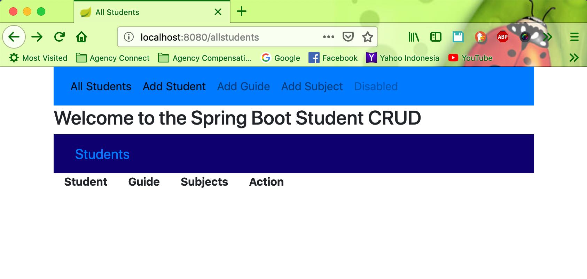
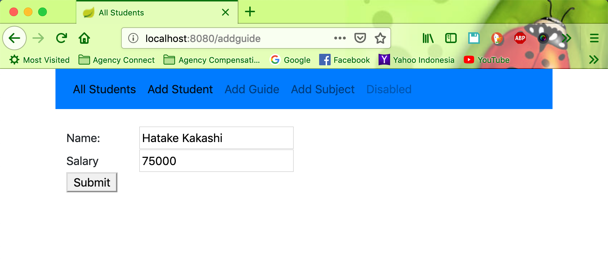
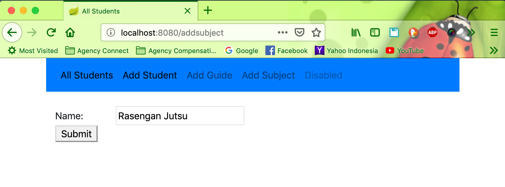
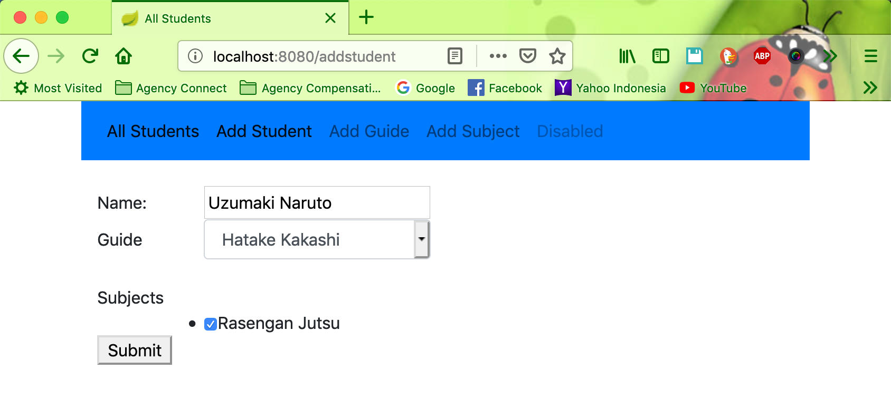

# springboot-student-crud

Spring Boot Student/Guide Demo

This is a Spring Boot project that allows you to manage Students in a school like setting through a user interface. First you add a few Subjects (Math, History, Science, etc). After you should add a few Guides, and then you can add and update Students.

The project uses Spring Boot, Spring Data JPA, and Thymeleaf. The project is using an H2 embedded MySQL database, but you can connect it to a local database through the application.properties file. Just unmark and add your information.

To run the project, clone or download it, and then go to the directory/student folder (where the mvnw file is) and run mvn spring-boot:run or just import the program into your IDE.

#### Clone the project
```
git clone https://github.com/hendisantika/springboot-student-crud.git
```

```
mvn clean spring-boot:run
```


#### Screen shot

##### Index Page



##### Add Guide



##### Add Subject



##### Add Student




An example can be found here: https://students-demo.herokuapp.com/
